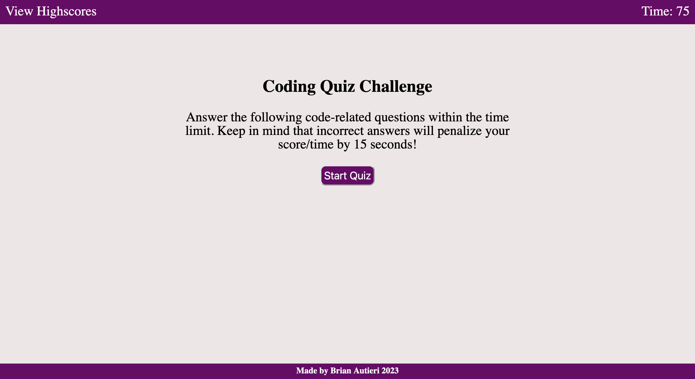

# Code Quiz

## Description

The purpose of this project was to create a code quiz so that users can test their knowledge of JavaScript. The goal of this quiz is to get a highscore by answering as many multiple choice questions correctly before the time runs out. When the user clicks on the "Start Quiz" button, they are presented with a series of multiple choice questions and a timer counting down from 75 seconds. When a question is answered correctly, the webpage will display "Correct!" and if the wrong answer is selected, "Wrong!" will appear and deduct 15 seconds from the timer.

## Usage

Users can follow the link to the deployed webpage to access the code quiz. Once on the page, users can click on the "Start Quiz" button to test their knoweledge of JavaScript concepts.

### Webpage Link

https://brian-autieri.github.io/code-quiz/index.html

### Webpage Screenshot

## Credits

This challenge was completed in collaboration with the instructional staff, TA and classmates in the February 2023 UCLA Extension Coding Boot Camp.

## License

MIT License

Copyright (c) 2023 Brian Autieri

Permission is hereby granted, free of charge, to any person obtaining a copy of this software and associated documentation files (the "Software"), to deal in the Software without restriction, including without limitation the rights to use, copy, modify, merge, publish, distribute, sublicense, and/or sell copies of the Software, and to permit persons to whom the Software is furnished to do so, subject to the following conditions:

The above copyright notice and this permission notice shall be included in all copies or substantial portions of the Software.

THE SOFTWARE IS PROVIDED "AS IS", WITHOUT WARRANTY OF ANY KIND, EXPRESS OR IMPLIED, INCLUDING BUT NOT LIMITED TO THE WARRANTIES OF MERCHANTABILITY, FITNESS FOR A PARTICULAR PURPOSE AND NONINFRINGEMENT. IN NO EVENT SHALL THE AUTHORS OR COPYRIGHT HOLDERS BE LIABLE FOR ANY CLAIM, DAMAGES OR OTHER LIABILITY, WHETHER IN AN ACTION OF CONTRACT, TORT OR OTHERWISE, ARISING FROM, OUT OF OR IN CONNECTION WITH THE SOFTWARE OR THE USE OR OTHER DEALINGS IN THE SOFTWARE.
